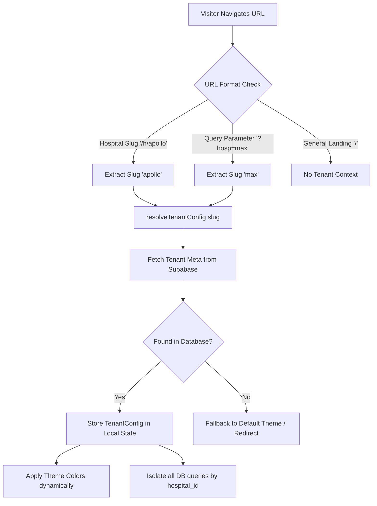

# MedQueue Multi-Tenancy & Brand Flow

This document details how MedQueue implements **route-based multi-tenant isolation** and manages dynamic brand styles, layouts, and data separation across clinic nodes.

---

## The Tenant lifecycle flow

Each hospital/clinic node operates on an isolated tenant boundary. MedQueue maps the tenant's brand and database records using a human-readable unique **slug**.



---

## 1. Domain & Slug Resolution (`client/src/lib/tenant.ts`)

The active clinic branch is identified contextually from the browser address bar. MedQueue inspects two routing patterns:
1. **Subpath isolation**: `/h/:slug` (e.g. `http://localhost:3000/h/apollo`)
2. **Query parameters**: `?h=apollo` or `?hosp=apollo`

The tenant extraction logic:
- `getTenantSlug()`: Splits browser path parts or falls back to query params.
- `resolveTenantConfig(slug)`: Queries the Supabase database table `hospitals` to pull the branch's database primary key (`id`), official branch `name`, `logo_url`, `theme_color`, and offline contact values.

---

## 2. Shared Brand Styles Context

Once `resolveTenantConfig` resolves, the active configuration is injected into root React components.
- **Dynamic Theme Injectors**: Components read `tenant.theme_color` and inject it inline or apply it directly to elements:
  ```tsx
  <h1 className="text-xl font-bold" style={{ color: tenant?.theme_color }}>
    {tenant?.name}
  </h1>
  ```
- **Universal Header Contexting**: `UniversalHeader.tsx` reads the active slug, fetches live clinic settings (like `emergency_code`), and renders the branch badge (e.g. `APOLLO Campus`) with real-time health indicator lights.

---

## 3. Database & Operations Data Isolation

MedQueue protects medical data privacy by enforcing strict tenant-level isolation across all tables.

### Hospital ID Binding
Every entity (tokens, doctors, visits, prescriptions, appointments) carries a `hospital_id` UUID column referencing the parent hospital record.

### Isolation in Queries
All fetch requests strictly append an equality filter targeting the resolved tenant UUID:
```typescript
const { data, error } = await supabase
  .from('tokens')
  .select('*, patients(*)')
  .eq('hospital_id', resolvedHospitalId)
  .order('created_at');
```

This prevents cross-tenant data leaks at the application layer, ensuring that doctors and admins can only view patients within their assigned campus branch.
